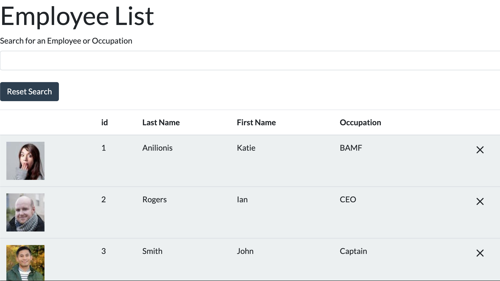

  
  
  
  # Employee Directory
  ## Description
  #### As an HR Manager, I am able to view all of my employees, sort by first name, last name, ID and occupation, delete employees, search by first name, last name, occupation, and ID to return the employee I would ike to reference.
  # Table of Contents
   * [Installation](#installation)
   * [Usage](#usage)
   * [License](#license)
   * [Contributors](#contributors)
   * [Tests](#tests)
   * [Questions](#questions)
  ## Installation
  #### react, bootstrap
  ## Usage
  ####  
  
  
  ###

  #### See Video of Usage Here:
  
  #### See Fully Deployed App on Heroku:
  
  ## License
  #### This project is licensed under the MIT license.
  ## Contributing
  #### 
  ## Test
  #### 
  ## Questions
  #### Email: <a>kanilionis@gmail.com</a>
  #### GitHub: <a>github.com/kanilionis</a>
  